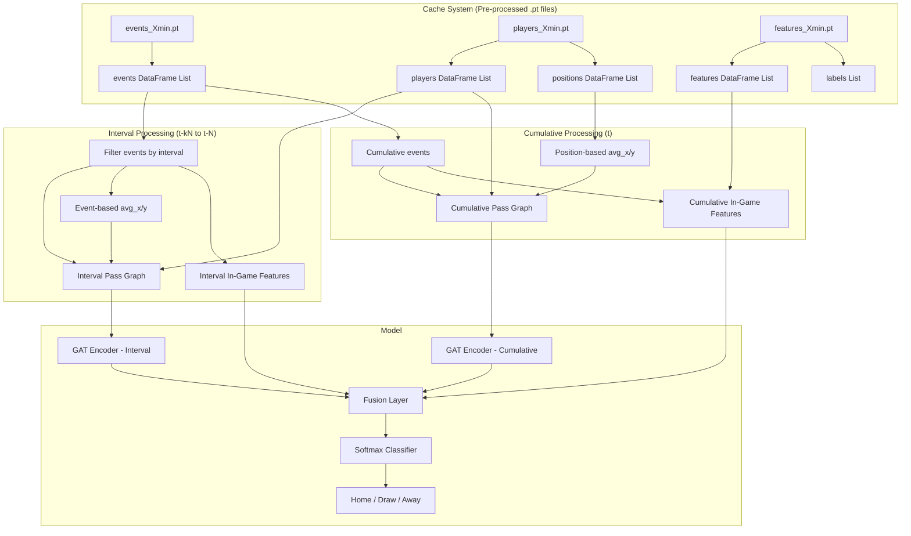

# Temporal Sliding Window Graph Attention Networks for Real-Time Football Match Outcome Prediction

## Overview

This model presents an advanced architecture for football match outcome prediction using a **temporal sliding window** approach that combines pass network graphs and in-game statistics from past time intervals. Built upon Model 3, it aims to produce more robust predictions by capturing historical context.

---

## Data Cache System

> [!IMPORTANT]
> This model uses **preprocessed `.pt` cache files instead of CSV files**. This eliminates CSV parsing overhead at each training iteration and significantly reduces training time.

### Cache File Structure

```
cache/
├── events_45min.pt      # All events up to minute 45
├── events_60min.pt      # All events up to minute 60
├── events_75min.pt      # All events up to minute 75
├── events_90min.pt      # All events up to minute 90
├── features_45min.pt    # Match features + labels (45 min)
├── features_60min.pt    # Match features + labels (60 min)
├── features_75min.pt    # Match features + labels (75 min)
├── features_90min.pt    # Match features + labels (90 min)
├── players_45min.pt     # Player info + positions (45 min)
├── players_60min.pt     # Player info + positions (60 min)
├── players_75min.pt     # Player info + positions (75 min)
└── players_90min.pt     # Player info + positions (90 min)
```

### Cache File Contents

#### `events_{pred_min}min.pt`
```python
{
    'events': List[pd.DataFrame],      # Events DataFrame for each match
    'match_ids': List[str],            # Match IDs
    'pred_min': int,                   # Prediction minute
    'n_matches': int,                  # Total number of matches
    'version': 'v1_universal'          # Version info
}
```

#### `players_{pred_min}min.pt`
```python
{
    'players': List[pd.DataFrame],     # Player info for each match
    'positions': List[pd.DataFrame],   # Player positions for each match
    'match_ids': List[str],            # Match IDs
    'pred_min': int,                   # Prediction minute
    'n_matches': int,                  # Total number of matches
    'version': 'v1_universal'          # Version info
}
```

#### `features_{pred_min}min.pt`
```python
{
    'features': List[pd.DataFrame],    # Features DataFrame for each match
    'labels': List[int],               # Match result labels (0: home, 1: away, 2: draw)
    'match_ids': List[str],            # Match IDs
    'pred_min': int,                   # Prediction minute
    'n_matches': int,                  # Total number of matches
    'label_map': {0: 'home_win', 1: 'away_win', 2: 'draw'},
    'version': 'v1_universal'          # Version info
}
```

### Cache Generation

Cache files are generated using the `universal_preprocess.py` script:

```bash
# Generate cache for all prediction minutes (45, 60, 75, 90)
python universal_preprocess.py --data_dir data/minute_90 --output_dir cache --pred_mins 45,60,75,90
```

### Cache Usage

Loading data from cache in the training script:

```python
import torch

def load_cache(cache_dir: Path, pred_min: int) -> Tuple[List, List, List, List, List]:
    """Load preprocessed data from cache."""
    events_cache = torch.load(cache_dir / f"events_{pred_min}min.pt")
    players_cache = torch.load(cache_dir / f"players_{pred_min}min.pt")
    features_cache = torch.load(cache_dir / f"features_{pred_min}min.pt")

    return (
        events_cache['events'],          # List[pd.DataFrame]
        players_cache['players'],        # List[pd.DataFrame]
        players_cache['positions'],      # List[pd.DataFrame]
        features_cache['features'],      # List[pd.DataFrame]
        features_cache['labels']         # List[int]
    )
```

### Advantages

| Feature | CSV (Raw) | Cache (.pt) |
|---------|-----------|-------------|
| Initial load time | ~5-10 min | ~10-30 sec |
| Memory usage | High (repeated parsing) | Optimized (one-time) |
| Parallel processing | Every time | During preprocessing |
| Time filtering | At runtime | During preprocessing |

---

## Architecture Diagram

```
┌─────────────────────────────────────────────────────────────────────────────────────────────┐
│                           TEMPORAL SLIDING WINDOW ARCHITECTURE                              │
├─────────────────────────────────────────────────────────────────────────────────────────────┤
│                                                                                             │
│  k = 2 Example (90 min prediction):                                                        │
│                                                                                             │
│  ┌──────────────────┐  ┌──────────────────┐  ┌──────────────────┐                          │
│  │   t - 2N (80-85) │  │   t - N (85-90)  │  │      t (0-90)    │                          │
│  │   Interval Graph │  │   Interval Graph │  │  Cumulative Graph│                          │
│  ├──────────────────┤  ├──────────────────┤  ├──────────────────┤                          │
│  │ 6 Node Features  │  │ 6 Node Features  │  │ 7 Node Features  │                          │
│  │ (no rating)      │  │ (no rating)      │  │ (with rating)    │                          │
│  │ - position       │  │ - position       │  │ - position       │                          │
│  │ - height         │  │ - height         │  │ - height         │                          │
│  │ - weight         │  │ - weight         │  │ - weight         │                          │
│  │ - pass_accuracy* │  │ - pass_accuracy* │  │ - rating         │                          │
│  │ - avg_x*         │  │ - avg_x*         │  │ - pass_accuracy  │                          │
│  │ - avg_y*         │  │ - avg_y*         │  │ - avg_x          │                          │
│  └────────┬─────────┘  └────────┬─────────┘  │ - avg_y          │                          │
│           │                     │            └────────┬─────────┘                          │
│           │                     │                     │                                    │
│           ▼                     ▼                     ▼                                    │
│  ┌──────────────────┐  ┌──────────────────┐  ┌──────────────────┐                          │
│  │  GAT Processing  │  │  GAT Processing  │  │  GAT Processing  │                          │
│  │  (3-layer)       │  │  (3-layer)       │  │  (3-layer)       │                          │
│  └────────┬─────────┘  └────────┬─────────┘  └────────┬─────────┘                          │
│           │                     │                     │                                    │
│           ▼                     ▼                     ▼                                    │
│  ┌──────────────────┐  ┌──────────────────┐  ┌──────────────────┐                          │
│  │ 22 In-Game Feats │  │ 22 In-Game Feats │  │ 22 In-Game Feats │                          │
│  │ (interval-based) │  │ (interval-based) │  │ (cumulative)     │                          │
│  └────────┬─────────┘  └────────┬─────────┘  └────────┬─────────┘                          │
│           │                     │                     │                                    │
│           └─────────────────────┼─────────────────────┘                                    │
│                                 │                                                          │
│                                 ▼                                                          │
│                     ┌──────────────────────┐                                               │
│                     │   FUSION LAYER       │                                               │
│                     │   Concatenate All    │                                               │
│                     └──────────┬───────────┘                                               │
│                                │                                                           │
│                                ▼                                                           │
│                     ┌──────────────────────┐                                               │
│                     │   FC + Softmax       │                                               │
│                     │   (3 classes)        │                                               │
│                     └──────────────────────┘                                               │
│                                │                                                           │
│                                ▼                                                           │
│                     ┌──────────────────────┐                                               │
│                     │   Home / Draw / Away │                                               │
│                     └──────────────────────┘                                               │
│                                                                                             │
└─────────────────────────────────────────────────────────────────────────────────────────────┘
```

---

## Key Variables

| Variable | Description | Example Value |
|----------|-------------|---------------|
| **t** | Prediction timestamp (cumulative data cutoff) | 90 min |
| **N** | Time interval width (sliding window size) | 5 min |
| **k** | Number of historical intervals to include | 1, 2, or 3 |

---

## Graph Types

### 1. Cumulative Graph (t)

This graph contains **all cumulative data** from the start of the match up to minute `t`.

#### Node Features (7 features)

| Feature | Description | Source | Data Leakage Risk |
|---------|-------------|--------|-------------------|
| `position` | Label-encoded player position (1-15) | `players.csv` | ✗ Pre-match |
| `height` | Player height in cm | `players.csv` | ✗ Static |
| `weight` | Player weight in kg | `players.csv` | ✗ Static |
| `rating` | WhoScored player rating | `players.csv` | Just in cumulative |
| `pass_accuracy` | Cumulative pass success rate | `passes.csv` | ✗ Calculated |
| `avg_x` | Average x position (0-100) | `player_positions.csv` | ✗ Calculated |
| `avg_y` | Average y position (0-100) | `player_positions.csv` | ✗ Calculated |

> [!WARNING]
> The **rating** feature is used only in the cumulative graph (t). It has been **removed** from interval graphs to prevent data leakage.

---

### 2. Interval Graphs (t-kN to t-N)

These graphs contain **only data belonging to that specific interval** (e.g., minutes 80-85).

#### Node Features (6 features - rating removed)

| Feature | Description | Source | Calculation |
|---------|-------------|--------|-------------|
| `position` | Label-encoded player position | `players.csv` | Static |
| `height` | Player height in cm | `players.csv` | Static |
| `weight` | Player weight in kg | `players.csv` | Static |
| `pass_accuracy` | Interval-specific pass success | `events.csv` | Per-interval |
| `avg_x` | Event-based avg x position | `events.csv` | Per-player mean |
| `avg_y` | Event-based avg y position | `events.csv` | Per-player mean |

> [!IMPORTANT]
> In interval graphs, `avg_x` and `avg_y` are computed as the mean x and y coordinates of all events performed by each player within that interval from `events.csv`, rather than from `player_positions.csv`.

---

## In-Game Features (22 per team)

### 16 In-Game Features (computed from `events.csv`)

```python
IN_GAME_FEATURE_COLS = [
    'ball_touches',
    'substitutions',
    'aerials',
    'ball_recoveries',
    'blocked_passes',
    'cards',
    'clearances',
    'corners_awarded',
    'dispossessions',
    'fouls',
    'interceptions',
    'missed_shots',
    'saved_shots',
    'tackles',
    'take_ons',
    'offsides_provoked',
]
```

### Additional 6 Event-Based Features (from `events.csv`)

```python
EVENT_FEATURE_COLS = [
    'pass_success_rate',
    'final_third_passes',
    'crosses',
    'key_passes',
    'big_chance',
    'shot_assist',
]
```

---

## Temporal Windows Configuration

### Example: 90-Minute Prediction with k=2, N=5

| Window | Time Range | Graph Type | Node Features | In-Game Calculation |
|--------|------------|------------|---------------|---------------------|
| t-2N | 80-85 min | Interval | 6 (no rating) | Interval-only stats |
| t-N | 85-90 min | Interval | 6 (no rating) | Interval-only stats |
| t | 0-90 min | Cumulative | 7 (with rating) | Cumulative stats |

### Example: 45-Minute Prediction with k=1, N=5

| Window | Time Range | Graph Type | Node Features | In-Game Calculation |
|--------|------------|------------|---------------|---------------------|
| t-N | 40-45 min | Interval | 6 (no rating) | Interval-only stats |
| t | 0-45 min | Cumulative | 7 (with rating) | Cumulative stats |

---

## Data Flow



---

## Feature Calculation Details

### Interval-based avg_x and avg_y

Player positions for interval graphs are computed from `events.csv`:

```python
def calculate_player_avg_position(events: pd.DataFrame, player_id: int,
                                   start_min: int, end_min: int) -> Tuple[float, float]:
    """
    Calculate average x and y position for a player within a time interval.
    Uses all events (passes, shots, tackles, etc.) made by the player.
    """
    player_events = events[
        (events['playerId'] == player_id) &
        (events['expandedMinute'] >= start_min) &
        (events['expandedMinute'] < end_min)
    ]

    if len(player_events) == 0:
        return 50.0, 50.0  # Default center position

    avg_x = player_events['x'].mean()
    avg_y = player_events['y'].mean()

    return avg_x, avg_y
```

### Interval-based Pass Graph Construction

```python
def create_interval_pass_graph(passes: pd.DataFrame, events: pd.DataFrame,
                                players: pd.DataFrame, team_id: int,
                                start_min: int, end_min: int) -> Data:
    """
    Create pass graph for a specific time interval.
    - Edges: Only passes within [start_min, end_min)
    - Node features: 6 features (no rating)
    - avg_x, avg_y: Calculated from events within interval
    """
    interval_passes = passes[
        (passes['teamId'] == team_id) &
        (passes['expandedMinute'] >= start_min) &
        (passes['expandedMinute'] < end_min)
    ]

    # Build edge list from interval passes
    # Calculate node features with event-based positions
    # Return PyTorch Geometric Data object
    ...
```

---

## Model Architecture

### Input Dimensions

| Component | Home | Away | Total |
|-----------|------|------|-------|
| Cumulative Graph (t) | 7-dim nodes | 7-dim nodes | 14-dim per player |
| Interval Graph × k | 6-dim nodes | 6-dim nodes | 12-dim per player × k |
| Cumulative In-Game | 22 features | 22 features | 44 features |
| Interval In-Game × k | 22 features | 22 features | 44 features × k |

### GAT Configuration (Shared Weights Optional)

```python
class TemporalPassNetworkGAT(nn.Module):
    def __init__(self, cumulative_input_size=7, interval_input_size=6,
                 hidden_channels=128, k=2, n=5):
        super().__init__()

        # Separate GAT encoders for cumulative and interval graphs
        self.cumulative_gat = GATEncoder(cumulative_input_size, hidden_channels)
        self.interval_gat = GATEncoder(interval_input_size, hidden_channels)

        # Fusion layer
        graph_dim = hidden_channels * (1 + k) * 2  # home + away × (cumulative + k intervals)
        feature_dim = 22 * (1 + k) * 2  # in-game features

        self.fusion = nn.Linear(graph_dim + feature_dim, 128)
        self.classifier = nn.Linear(128, 3)  # Home / Draw / Away
```

---

## Training Configuration

```python
# Hyperparameters
CONFIG = {
    't': [45, 60, 75, 90],      # Prediction timestamps
    'N': 5,                      # Interval width (minutes)
    'k': [1, 2, 3],              # Historical depth options
    'batch_size': 32,
    'learning_rate': 0.001,
    'epochs': 1000,
    'patience': 50,              # Early stopping
    'class_weights': 'inverse',  # Handle class imbalance
}
```

---

## File Structure

```
TSW-GAT/
├── ARCHITECTURE.md                  # This documentation
├── universal_preprocess.py          # Cache generator (shared across all models)
├── cache/                           # Preprocessed data cache
│   ├── events_45min.pt
│   ├── events_60min.pt
│   ├── events_75min.pt
│   ├── events_90min.pt
│   ├── features_45min.pt
│   ├── features_60min.pt
│   ├── features_75min.pt
│   ├── features_90min.pt
│   ├── players_45min.pt
│   ├── players_60min.pt
│   ├── players_75min.pt
│   └── players_90min.pt
└── model4_temporal_sliding_window/
    ├── pass_network_creator.py      # Graph construction with temporal windows
    ├── gat_model_temporal.py        # Temporal GAT architecture
    ├── train_model.py               # Training script
    ├── test_model.py                # Evaluation script
    ├── models/                      # Saved model checkpoints
    └── logs/                        # Test and train logs
```

---

## Comparison with We Know Who Wins

| Feature | We Know Who Wins | Model 4 (Temporal) |
|---------|------------------|-------------------|
| Graph Input | Single cumulative | Multiple temporal windows |
| Node Features (Cumulative) | 7 (with rating) | 7 (with rating) |
| Node Features (Interval) | N/A | 6 (no rating) |
| In-Game Features | 16 | 22 per window |
| Temporal Context | None | k intervals × N minutes |
| Computational Cost | Low | Medium-High (k-dependent) |

---

## Notes

> [!NOTE]
> - **N=3** minute intervals are recommended since momentum shifts in football are typically observed within this timeframe.
> - **k=1 or k=2** are recommended as starting values; higher k values increase computational cost.
> - The rating feature has been removed from interval graphs because it represents a cumulative player performance summary up to that timestamp rather than a discrete in-match event, making it redundant with the temporal features already captured by the model.

> [!TIP]
> Event-based `avg_x` and `avg_y` computation reflects the positions where the player was actually active during that interval, providing a dynamic representation.
